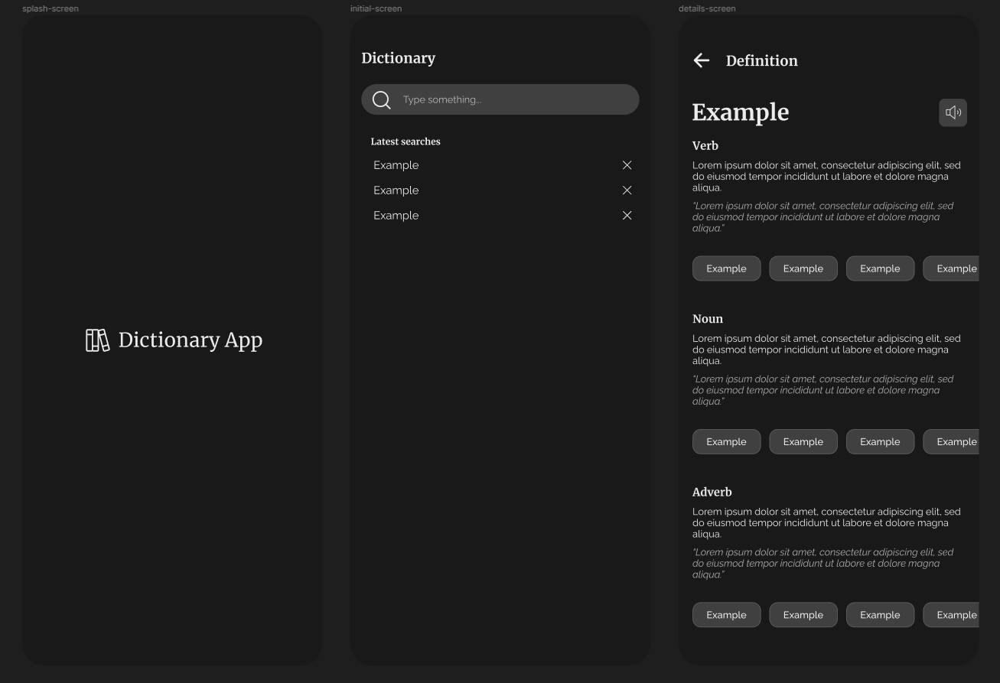

<h1 align="center">
    
    <br>
    Dictionary App! Aplicativo de dicionário
</h1>

<div align="center">
  
</div>

# Sobre

Definição e pronúncia (em audio) para palavras em inglês.

<br />

[Free Dictionary API](https://dictionaryapi.dev/) utilizada para pegar os dados.
Limitei as definições e exemplos para um de cada, pois em algumas palavras são
retornados MUITOS dados.

<br />

OBS: Os dados da API são em inglês, então desenvolvi o app inteiramente em inglês, para manter a consistência.

# Tecnologias

Usado as seguintes tecnologias:

- [React Native](https://reactnative.dev/)
- [Expo](https://expo.dev/)
- [Typescript](https://www.typescriptlang.org/)
- [Expo-AV](https://docs.expo.dev/versions/latest/sdk/av/)
- [Async Storage](https://react-native-async-storage.github.io/async-storage/docs/usage/)
- [React Navigation](https://reactnavigation.org/)
- [React Query](https://react-query-v2.tanstack.com/)
- [Jest](https://jestjs.io/pt-BR/)
- [Testing Library](https://testing-library.com/docs/react-native-testing-library/intro/)

# Rodando o projeto

Você precisa ter o [Node](https://nodejs.org/en/), o [Git](https://git-scm.com/) e algum gerenciador de pacotes([NPM](https://docs.npmjs.com/downloading-and-installing-node-js-and-npm/) || [Yarn](https://classic.yarnpkg.com/lang/en/docs/install)) instalados em sua máquina.

Use o [ExpoGo](https://expo.dev/client) para rodar o app no seu dispositivo fisico ou no emulador.

```bash
1. Clone o repositório:
$ git clone https://github.com/gabriellima2/dictionary-app.git

2. Acesse a pasta e instale as dependências via terminal:
$ yarn || npm i

3. Inicie a aplicação em modo de desenvolvimento:
$ yarn start || npm run start

4. Escaneie o QRCode ou digite a URL informada
```

<p align="center">Projeto feito com 💙 por <a href="https://www.linkedin.com/in/gabriel-lima-860612236">Gabriel Lima</a></p>
